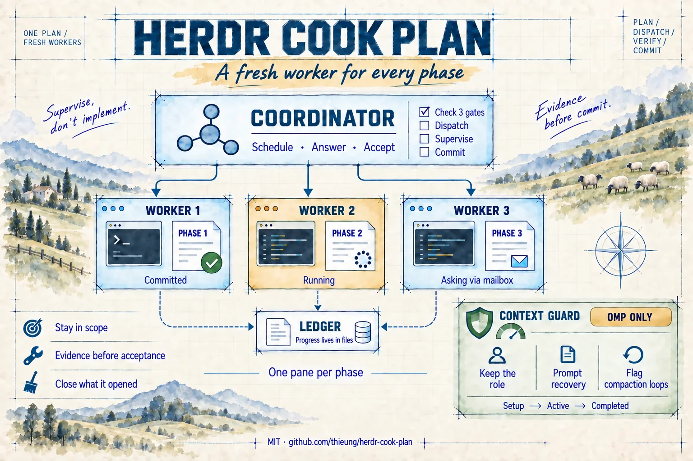
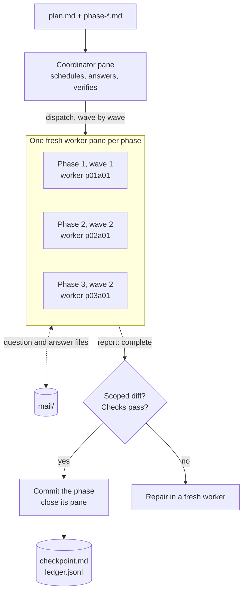

# Herdr Cook Plan

English | [Tiếng Việt](README.vi.md)



A coding-agent skill that runs an existing [AgentKit](https://agentkit.best/?ref=OMG49S8R) plan phase by
phase through [Herdr](https://herdr.dev). Every phase gets a fresh worker agent in its own Herdr pane,
sequentially or in parallel depending on dependencies. The coordinator supervises from its own pane: it
answers worker questions through a file mailbox, verifies each phase's evidence, commits it, and closes
the panes it opened. It never implements a phase itself, so it survives compaction, quota exhaustion
and provider fallback without carrying the work.

MIT licensed.

> **Public edition, provided as-is.** Full support is available in the edition for members of
> [Thieu Nguyen's Facebook Subscribers group](https://www.facebook.com/groups/1312173340952529).
> Issues and pull requests here are welcome but may not get a response.

## Why this skill

Running a whole multi-phase plan in one agent session breaks down in predictable ways:

- **Compaction compounds.** A long plan fills the context window several times over. Each
  auto-compaction replaces detail with a summary: file paths, decisions, constraints and half-finished
  reasoning get dropped, and later phases are built on a lossy summary of the earlier ones. Quality
  slides with every compaction, and the agent may redo work or skip steps it believes are done.
- **Noise carries over.** Logs, failed attempts and debugging from phase 1 are still in context when
  phase 4 starts. They cost tokens and pull attention away from the current phase.
- **"Done" is self-graded.** The agent that wrote the code also decides it is finished, and an idle
  terminal or a confident summary gets treated as success.
- **You become the scheduler.** Someone has to type "continue", answer questions, notice a stall and
  remember which phase comes next.

Herdr Cook Plan separates the roles:

- **Every phase starts with a clean, full context.** A fresh worker gets only its phase brief, the plan
  and the repository, so it is far less likely to hit compaction and never inherits another phase's
  noise. If a worker still runs low, it leaves notes and a handoff for a fresh attempt.
- **The coordinator stays light.** It holds the schedule, the answers and the evidence, not the
  implementation. When it does compact, the state is on disk (checkpoint, ledger, lease), so it recovers
  exactly instead of from memory.
- **Done means evidence.** A phase counts only with a complete report, a scoped diff and passing checks,
  verified by an agent other than the one that wrote it.
- **One commit per phase.** History you can review, revert or bisect phase by phase, plus an append-only
  ledger of every decision.
- **Parallel where it is safe.** Independent phases run side by side; overlapping writes are serialized.
- **You are asked only for real decisions.** Questions travel through the mailbox. With `--auto` the
  coordinator decides inside the plan's scope and records why; it never authorizes scope growth,
  publishing or destructive operations.
- **Crashes and quota limits do not lose work.** Accepted phases are never replayed; the run resumes
  from its checkpoint.
- **Nothing is left behind.** Worker panes close as their phases are accepted, and a completion check
  verifies the cleanup.
- **Mix runtimes.** The coordinator can run on one agent (Codex, say) and the workers on another (OMP).

Not the right tool for a change that fits in one session, for work that has no plan yet (write the plan
first), or for handing a task off to another agent entirely.

## How it works



Worker names read as phase and attempt: `p02a01` is phase 2, attempt 1. If that worker has to be
replaced, the new one is `p02a02`, so it never picks up an answer meant for its predecessor.

1. **Gates.** Inside Herdr, Herdr 0.9.1+, integrations current. Any failure stops the run.
2. **Wave table.** Phases, dependencies, write scope, runtime and checks; independent phases run in
   parallel, two workers by default.
3. **Dispatch.** A new pane and a new agent per attempt, prompted from a checked brief file.
4. **Supervise.** Each round scans the mailbox and waits on every worker. An idle terminal is not
   success; a timeout is not approval.
5. **Accept and commit.** A phase is accepted on a `status: complete` report, a settled agent, a scoped
   diff and passing checks. Intent goes to the checkpoint first, then a commit of only that phase's
   paths, then a `phase-accepted` ledger line with the SHA. The worker pane closes before the next dispatch.
6. **Close the run.** `implementation-summary.md`, `scripts/check-run-closed.py`, `run-completed`, and
   the lease released last.

Run state lives in files under `<plan-dir>/reports/herdr-cook-runs/<runId>/`, so a compacted or
restarted coordinator recovers in the same session. The full loop, state files and failure map are in
[docs/workflow.md](docs/workflow.md).

## Requirements

- Herdr 0.9.1 or newer, and the skill invoked **inside a Herdr pane** (`HERDR_ENV=1`).
- The [Herdr agent skill](https://herdr.dev/docs/agent-skill/), which teaches agents to drive Herdr
  (panes, agents, waits). Install it with Node.js: `npx skills add herdrdev/herdr --skill herdr -g`
  (omit `-g` to install it into the current project only).
- A Herdr integration at `current` for every worker runtime you use:
  `herdr integration status`, then `herdr integration install <kind>` for any that is missing.
- [AgentKit's Engineer Kit](https://agentkit.best/?ref=OMG49S8R) (referral link, 30% discount) in each worker runtime,
  because workers run `ak:cook`:
  `ak kit init engineer --target <runtime> --yes`
- Python 3 (for the completion check). Git is strongly recommended: each accepted phase becomes one commit.

## Install

Clone the repository and copy the `herdr-cook-plan/` directory into your runtime's skills directory:

```bash
git clone --depth 1 https://github.com/thieung/herdr-cook-plan.git
cp -R herdr-cook-plan/herdr-cook-plan ~/.claude/skills/
```

| Runtime | Project | Global |
|---|---|---|
| Claude Code | `.claude/skills/` | `~/.claude/skills/` |
| Codex | `.agents/skills/` | `~/.agents/skills/` |
| OMP | `.omp/skills/` | `~/.omp/agent/skills/` |
| Pi | `.pi/skills/` | `~/.pi/agent/skills/` |
| Cursor | `.cursor/skills/` | `~/.cursor/skills/` |
| Grok CLI | `.grok/skills/` | `~/.grok/skills/` |

To update, pull and copy again.

### OMP: start the coordinator with the context guard

The guard is an OMP extension. Nothing registers it automatically, so launch the coordinator with it:

```bash
omp --extension ~/.omp/agent/skills/herdr-cook-plan/extensions/context-guard.mjs
```

The coordinator adds the same flag to every OMP worker it starts. Do not use `--no-extensions`: it also
disables Herdr's own OMP integration, and worker `blocked`/`idle` states stop being trustworthy.

## Use

Open a Herdr pane in your project and invoke the skill with a plan path (or a directory containing
`plan.md`):

```text
/herdr-cook-plan plan.md --auto                          # Claude Code, Cursor, Grok CLI
/skill:herdr-cook-plan plan.md --auto                    # OMP, Pi
$herdr-cook-plan plan.md --select-agent --auto --advice  # Codex
/skill:herdr-cook-plan plan.md --runtime omp --omp-advisor all --auto
```

| Flag | Effect |
|---|---|
| `--runtime <kind>` | Worker runtime by Herdr agent kind. Defaults to the coordinator's own kind. |
| `--model <id>` | Primary worker model, passed through the kind's native argv. |
| `--select-agent` | Ask once for worker runtime and model before the first dispatch. |
| `--auto` | The coordinator decides in-plan approvals and records why. Never covers scope expansion, publishing, deployment or destructive operations. |
| `--omp-advisor all\|none\|<phase,...>` | OMP's own advisor per worker. OMP workers only. |
| `--parallel` | Prefer parallel scheduling; dependencies and write conflicts still force serial runs. |
| `--advice`, `--tdd`, other cook flags | Forwarded to `ak:cook` after checking the installed cook. |

## Status and known limits

- Automatic recovery prompts (the context guard) exist only on OMP. Other runtimes recover from the
  checkpoint files.
- The guard is unit-tested; its behaviour under a real compaction has not been observed yet.
- Live smoke so far is bounded: two phases accepted and committed, completion check passing.
- A worker may still write `plans/journals/*` outside its phase's write scope.
- Cook availability for Claude Code and Codex must be discovered on your machine before the first dispatch.

Run the tests:

```bash
python3 herdr-cook-plan/tests/instruction-contract.test.py
node --test herdr-cook-plan/tests/context-guard.test.mjs
```

## Using Orca instead of Herdr?

[Orca Cook Plan](https://cookplan.slopengineer.dev) is the Orca edition of this workflow, available to
members of Thieu Nguyen's Facebook Subscribers group. It installs and updates with one command and
registers its OMP context guard for you. [Join the group](https://www.facebook.com/groups/1312173340952529)
to get access.

## License

MIT. See [LICENSE](LICENSE). Herdr and AgentKit are separate projects with their own terms.
