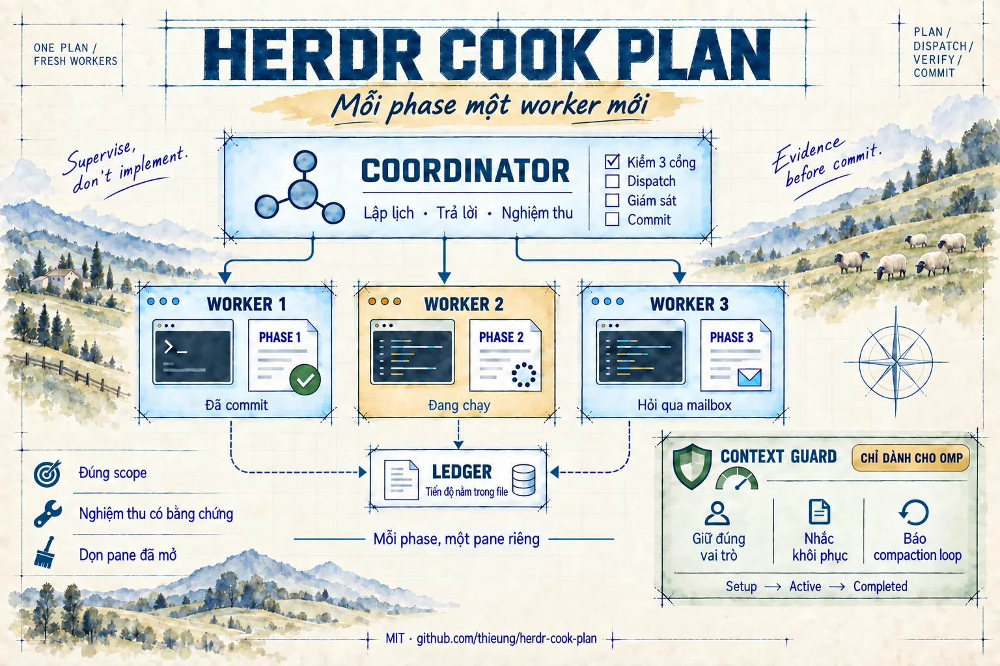
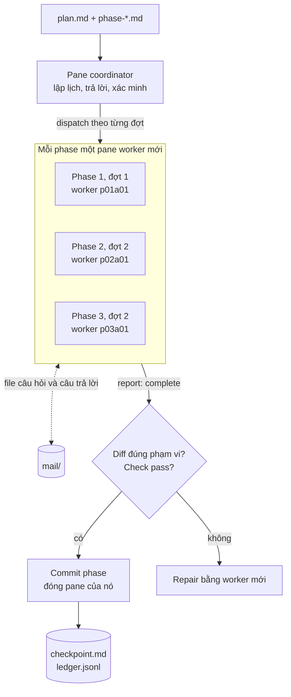

# Herdr Cook Plan

[English](README.md) | Tiếng Việt



Skill cho coding agent, chạy một [AgentKit](https://agentkit.best/?ref=OMG49S8R) plan có sẵn qua
[Herdr](https://herdr.dev) theo từng phase. Mỗi phase có một worker agent mới trong pane Herdr riêng,
chạy tuần tự hoặc song song tùy dependency. Coordinator giám sát từ pane của mình: trả lời câu hỏi của
worker qua mailbox dạng file, xác minh bằng chứng của từng phase, commit rồi đóng những pane nó đã mở.
Coordinator không bao giờ tự implement một phase, nên nó chịu được compaction, hết quota hay đổi provider
mà không phải mang theo phần việc.

Giấy phép MIT.

> **Bản công khai, cung cấp nguyên trạng.** Full support có ở phiên bản dành cho thành viên
> [nhóm Facebook Subscribers của Thieu Nguyen](https://www.facebook.com/groups/1312173340952529).
> Issue và pull request ở đây luôn được chào đón nhưng có thể không được phản hồi.

## Vì sao cần skill này

Chạy cả một plan nhiều phase trong một session agent duy nhất sẽ hỏng theo những kiểu dễ đoán:

- **Compaction dồn lên nhau.** Một plan dài làm đầy context window nhiều lần. Mỗi lần auto-compaction,
  chi tiết bị thay bằng bản tóm tắt: đường dẫn file, quyết định, ràng buộc và mạch suy luận dang dở rơi
  mất, và các phase sau được xây trên bản tóm tắt thiếu hụt của các phase trước. Chất lượng giảm dần
  sau mỗi lần compaction, agent có thể làm lại việc đã xong hoặc bỏ qua bước nó tưởng đã làm.
- **Nhiễu bị mang theo.** Log, lần thử hỏng và quá trình debug của phase 1 vẫn còn trong context khi
  phase 4 bắt đầu, vừa tốn token vừa kéo sự chú ý khỏi phase hiện tại.
- **Tự chấm "xong".** Agent viết code cũng là agent quyết định nó đã xong; terminal im lặng hay một bản
  tóm tắt tự tin bị coi là thành công.
- **Bạn thành người điều phối.** Phải có người gõ "làm tiếp đi", trả lời câu hỏi, phát hiện chỗ kẹt và
  nhớ phase nào đến lượt.

Herdr Cook Plan tách vai trò:

- **Mỗi phase bắt đầu với context sạch và đầy đủ.** Worker mới chỉ nhận brief của phase, plan và
  repository, nên ít khi chạm tới compaction và không thừa hưởng nhiễu của phase khác. Nếu worker vẫn
  cạn context, nó để lại notes và handoff cho một attempt mới.
- **Coordinator luôn nhẹ.** Nó chỉ giữ lịch, câu trả lời và bằng chứng, không giữ phần implement. Khi có
  compaction, trạng thái nằm trên đĩa (checkpoint, ledger, lease) nên nó khôi phục chính xác thay vì dựa
  vào trí nhớ.
- **Xong nghĩa là có bằng chứng.** Phase chỉ được tính khi có report hoàn tất, diff đúng phạm vi và
  check pass, do một agent khác với agent viết code xác minh.
- **Mỗi phase một commit.** Lịch sử review, revert hay bisect được theo từng phase, kèm ledger chỉ ghi
  thêm cho mọi quyết định.
- **Song song khi an toàn.** Phase độc lập chạy cạnh nhau; phase ghi chồng file thì chạy tuần tự.
- **Chỉ hỏi bạn những quyết định thật.** Câu hỏi đi qua mailbox. Với `--auto`, coordinator tự quyết
  trong phạm vi plan và ghi lý do; không bao giờ tự cho phép mở rộng scope, publish hay thao tác phá hủy.
- **Crash hay hết quota không làm mất việc.** Phase đã nghiệm thu không bao giờ bị chạy lại; run tiếp
  tục từ checkpoint.
- **Không để lại rác.** Pane của worker đóng ngay khi phase được nghiệm thu, và một bước kiểm tra cuối
  xác minh việc dọn dẹp.
- **Kết hợp nhiều runtime.** Coordinator có thể chạy trên một agent (ví dụ Codex) còn worker chạy trên
  agent khác (ví dụ OMP).

Không phù hợp cho thay đổi nhỏ gói gọn trong một session, cho việc chưa có plan (hãy viết plan trước),
hoặc khi muốn giao hẳn công việc cho một agent khác.

## Cách hoạt động



Tên worker đọc theo phase và lần thử (attempt): `p02a01` là phase 2, lần 1. Nếu phải thay worker đó,
worker mới là `p02a02`, nên nó không bao giờ nhận nhầm câu trả lời dành cho worker trước.

1. **Kiểm cổng.** Đang ở trong Herdr, Herdr 0.9.1 trở lên, integration đều `current`. Thiếu cổng nào là
   dừng run.
2. **Bảng đợt thực hiện.** Phase, dependency, phạm vi ghi, runtime và cách kiểm tra; phase độc lập chạy
   song song, mặc định hai worker.
3. **Dispatch.** Mỗi lần thử một pane mới và một agent mới, nhận prompt từ một file brief đã kiểm tra.
4. **Giám sát.** Mỗi vòng quét mailbox và chờ từng worker. Terminal idle không phải là thành công; hết
   giờ chờ không phải là đồng ý.
5. **Nghiệm thu và commit.** Phase được nghiệm thu khi có report `status: complete`, agent đã settle, diff
   đúng phạm vi và check pass. Ý định được ghi vào checkpoint trước, rồi commit chỉ các path của phase đó,
   rồi thêm dòng `phase-accepted` kèm SHA vào ledger. Pane của worker được đóng trước lần dispatch kế tiếp.
6. **Đóng run.** `implementation-summary.md`, `scripts/check-run-closed.py`, `run-completed`, và nhả
   lease sau cùng.

Trạng thái run nằm trong file dưới `<plan-dir>/reports/herdr-cook-runs/<runId>/`, nên coordinator bị
compaction hay restart vẫn khôi phục được ngay trong session đó. Toàn bộ vòng chạy, các file trạng thái
và bảng lỗi nằm trong [docs/workflow.md](docs/workflow.md) (tiếng Anh).

## Yêu cầu

- Herdr 0.9.1 trở lên, và skill phải được gọi **bên trong một pane Herdr** (`HERDR_ENV=1`).
- [Herdr agent skill](https://herdr.dev/docs/agent-skill/), dạy agent cách điều khiển Herdr (pane,
  agent, chờ tiến trình). Cài bằng Node.js: `npx skills add herdrdev/herdr --skill herdr -g`
  (bỏ `-g` nếu chỉ cài cho dự án hiện tại).
- Integration của Herdr ở trạng thái `current` cho mọi runtime worker bạn dùng:
  `herdr integration status`, rồi `herdr integration install <kind>` cho kind nào còn thiếu.
- [Engineer Kit của AgentKit](https://agentkit.best/?ref=OMG49S8R) (link giới thiệu) trong mỗi runtime
  worker, vì worker chạy `ak:cook`:
  `ak kit init engineer --target <runtime> --yes`
- Python 3 (cho bước kiểm tra đóng run). Rất nên dùng Git: mỗi phase được nghiệm thu thành một commit.

## Cài đặt

Clone repository rồi copy thư mục `herdr-cook-plan/` vào thư mục skills của runtime:

```bash
git clone --depth 1 https://github.com/thieung/herdr-cook-plan.git
cp -R herdr-cook-plan/herdr-cook-plan ~/.claude/skills/
```

| Runtime | Theo dự án | Global |
|---|---|---|
| Claude Code | `.claude/skills/` | `~/.claude/skills/` |
| Codex | `.agents/skills/` | `~/.agents/skills/` |
| OMP | `.omp/skills/` | `~/.omp/agent/skills/` |
| Pi | `.pi/skills/` | `~/.pi/agent/skills/` |
| Cursor | `.cursor/skills/` | `~/.cursor/skills/` |
| Grok CLI | `.grok/skills/` | `~/.grok/skills/` |

Muốn cập nhật thì pull rồi copy lại.

### OMP: khởi động coordinator kèm context guard

Guard là một extension của OMP. Không có gì tự đăng ký nó, nên hãy khởi động coordinator kèm guard:

```bash
omp --extension ~/.omp/agent/skills/herdr-cook-plan/extensions/context-guard.mjs
```

Coordinator tự thêm cờ này cho mọi worker OMP nó khởi động. Đừng dùng `--no-extensions`: cờ đó tắt
luôn integration OMP của Herdr, khiến trạng thái `blocked`/`idle` của worker không còn đáng tin.

## Sử dụng

Mở một pane Herdr trong dự án rồi gọi skill với đường dẫn plan (hoặc thư mục chứa `plan.md`):

```text
/herdr-cook-plan plan.md --auto                          # Claude Code, Cursor, Grok CLI
/skill:herdr-cook-plan plan.md --auto                    # OMP, Pi
$herdr-cook-plan plan.md --select-agent --auto --advice  # Codex
/skill:herdr-cook-plan plan.md --runtime omp --omp-advisor all --auto
```

| Flag | Tác dụng |
|---|---|
| `--runtime <kind>` | Runtime của worker theo agent kind của Herdr. Mặc định là kind của chính coordinator. |
| `--model <id>` | Model chính của worker, truyền qua argv gốc của kind. |
| `--select-agent` | Hỏi runtime và model của worker một lần trước dispatch đầu tiên. |
| `--auto` | Coordinator tự quyết các approval trong phạm vi plan và ghi lý do. Không bao giờ bao gồm mở rộng scope, publish, deploy hay thao tác phá hủy. |
| `--omp-advisor all\|none\|<phase,...>` | Advisor riêng của OMP cho từng worker. Chỉ dùng cho worker OMP. |
| `--parallel` | Ưu tiên chạy song song; dependency và xung đột ghi vẫn buộc chạy tuần tự. |
| `--advice`, `--tdd`, các flag cook khác | Chuyển xuống `ak:cook` sau khi đối chiếu với bản cook đã cài. |

## Tình trạng và giới hạn đã biết

- Nhắc khôi phục tự động (context guard) chỉ có trên OMP. Runtime khác khôi phục từ các file checkpoint.
- Guard đã có unit test; hành vi của nó dưới một lần compaction thật chưa được quan sát.
- Live smoke đến nay còn giới hạn: hai phase được nghiệm thu và commit, bước kiểm tra đóng run pass.
- Worker vẫn có thể ghi thêm `plans/journals/*` ngoài phạm vi ghi của phase.
- Khả năng chạy cook trên Claude Code và Codex phải được dò trên máy bạn trước lần dispatch đầu.

Chạy test:

```bash
python3 herdr-cook-plan/tests/instruction-contract.test.py
node --test herdr-cook-plan/tests/context-guard.test.mjs
```

## Dùng Orca thay vì Herdr?

[Orca Cook Plan](https://cookplan.slopengineer.dev) là phiên bản Orca của workflow này, dành cho thành
viên nhóm Facebook Subscribers của Thieu Nguyen. Cài và cập nhật bằng một lệnh, tự đăng ký context guard
cho OMP. [Tham gia nhóm](https://www.facebook.com/groups/1312173340952529) để được cấp quyền.

## Giấy phép

MIT. Xem [LICENSE](LICENSE). Herdr và AgentKit là các dự án riêng với điều khoản riêng.
