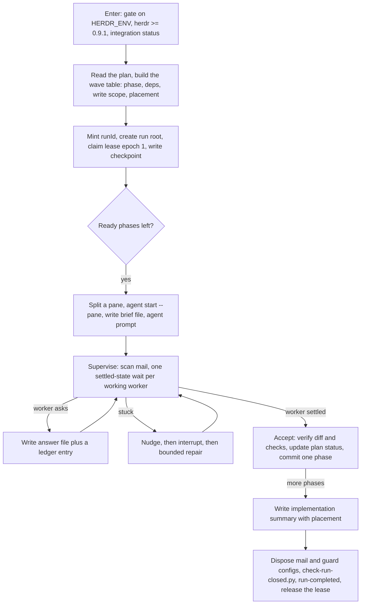

# herdr-cook-plan — documentation

Human documentation for the `herdr-cook-plan` skill. This file is **not** loaded by the skill at
runtime; the operational contract lives in the skill itself
(`herdr-cook-plan/SKILL.md` and its `references/`). Use this material for a landing page, an
onboarding guide, or a review of how the loop behaves.

# Workflow at a glance

One coordinator runs a plan; it never implements a phase itself. Every phase gets a **fresh pane and a
fresh agent**, running the worker's own cook skill.

Phase ordering, parallel limits and placement are decided **before any dispatch**; the placement rules
live in the skill's `references/runtimes.md`.

## Where state lives

Nothing important lives only in a model's context. Two different plans sit in different plan
directories; the same plan run twice gets two run roots, so no run can overwrite another's state.

| Path | What it is | Written by |
|---|---|---|
| `<plan-dir>/reports/herdr-cook-runs/<runId>/checkpoint.md` | The run's state: hot section (runId, lease, phase table, open question, next action) plus detail (wave table, execution guide, per-phase history) | Coordinator only |
| `.../mail/ledger.jsonl` | Append-only authority: `run-created`, `lease-claimed`, `answer`, `phase-accepted`, `run-completed`, `run-abandoned`; moved to the run root at completion | Coordinator only |
| `.../mail/brief-<phase>-a<aa>.txt` | One attempt's brief — its recovery artifact after compaction or a restart | Coordinator writes, worker re-reads |
| `.../mail/q-<phase>-a<aa>-<nn>.json`, `a-<phase>-a<aa>-<nn>.json` | Question and answer, keyed by attempt so a replacement never reads an old answer | Worker, then coordinator |
| `.../mail/report-<phase>-a<aa>.md`, `notes-<phase>-a<aa>.md` | Attempt report and worker-local notes | Worker |
| `.../implementation-summary.md` | Completion summary, including where each phase landed | Coordinator |
| `.../guard/` | Run-local guard configs and the paste overlay | Coordinator |

## The boundary check, and what it costs

At every boundary — dispatch, answer, acceptance, commit — the coordinator reads the **hot section**
(~40 lines, ~500 tokens) and confirms three things: the lease is still its own, the phase it is about
to touch is not already accepted, and the next action matches what it is about to do.

It escalates to a **full** checkpoint read plus a live reconcile (`herdr agent list`, `herdr pane list`)
only when a confirmation fails, the session was compacted or restarted, a wait ran past one round or an
answer arrived late, or the next mutation is hard to undo (acceptance commit, pane close, worktree
removal).

Measured on a real two-phase run: the checkpoint was 4,224 characters (78 lines, ~1,056 tokens) and the
run had seven boundaries. Whole-file re-reads would have cost ~7.4k tokens there and roughly 100k across
a ten-phase run, while also inflating the coordinator's context — the very thing that triggers
compaction. The bounded hot section keeps the normal path at ~500 tokens per boundary.

## Recovery

| Tier | Mechanism | Runs on |
|---|---|---|
| 1 | Files on disk plus the boundary check; the same session recovers, and a crashed run resumes on `resume run <runId>` | Every runtime, no hook needed |
| 2 | A runtime hook re-injects a short pointer after compaction or a fallback, telling the live session to re-read the checkpoint, Skill and recovery guide | OMP only, and only when launched with `--extension` |

Tier 1 is the foundation, not a fallback. Tier 2 exists for one runtime today; every other runtime is
marked *requires discovery* in the skill's `references/runtimes.md`, and the skill forbids claiming
automatic recovery without a verified mechanism.

After compaction the coordinator does not recall a summary — it is told to re-read the files, and it
verifies that by stating the run id, lease epoch, completed phases and next action from them.

## Concurrency

One run at a time, enforced at entry.

- **Another run exists** — this plan's run roots, sibling plans in the same plans root, a legacy
  single-file checkpoint, or a run naming this worktree and branch. The coordinator reports what it
  found (run id, plan, branch, phase progress, lease owner and heartbeat age, agents observed, and
  whether it looks live or stale) and **refuses to proceed**. It dispatches nothing, answers nothing,
  commits nothing and creates no run root. A live run is never taken over: the user returns to its
  pane, or stops that coordinator first.
- **A stale run is still refused.** A dead coordinator does not license a silent second start: the user
  says `resume run <runId>` or `abandon run <runId>`, and this session first checks that the old
  coordinator stopped writing, because the lease is cooperative and fences nothing. An abandoned run is
  recorded as terminal so it stops blocking later invocations; it is reported as abandoned, never as
  accepted work, and a crash while closing a run makes its resume finalize-only.
- **Parallel runs are not supported.** The only way two runs exist at once is an explicit user
  decision, and even then they need separate worktrees, branches or repositories.

## A worker that stops progressing

`working` is not progress; only a change is. A worker counts as stalled when three consecutive rounds
show an unchanged `revision` and `state_change_seq`, no new pane output, and no new mailbox file. The
escalation is cheapest-first: **nudge** (a queued `agent prompt`, sent without `--wait`), then
**interrupt** (`agent send-keys <name> esc`, then a resume prompt), then **bounded repair** (a fresh
worker for the same phase, one replacement), then **blocker** with the sampled evidence. Never
interrupt a worker that is progressing.

## Failure map

| Situation | What happens |
|---|---|
| Worker needs an approval | It writes `q-*.json` and polls; the coordinator writes `a-*.json` plus a ledger entry |
| Worker keeps its own dialog open | `blocked` fires; the coordinator reads the pane and answers with `pane send-text` + `pane send-keys enter`, recording that the mailbox was bypassed. Permission or trust prompts go to the user |
| Worker crashes or exhausts attempts | A fresh worker for the **same phase**, bounded to one context-driven replacement |
| Worker is compacted | It re-reads its `brief-<phase>-a<aa>.txt`, the checkpoint and its notes, then finishes only the unfinished acceptance |
| Coordinator is compacted | Tier 2 pointer when available; otherwise the next boundary check catches it |
| Nobody answers a question | Not an approval. The phase stays blocked and the coordinator escalates |
| Second invocation while a run is in flight | Refused at entry; a stale run continues only on `resume run <runId>` or ends on `abandon run <runId>` |
| Phase accepted | Diff and checks verified, plan status reconciled, one commit for that phase's owned paths only |
| Run complete | Panes closed per phase, summary written, run-local artifacts disposed, `check-run-closed.py` passed, `run-completed` appended, lease released last |

## What is verified, and what is not

Verified on this host:

- the negative gate — an agent outside Herdr refuses to proceed;
- a two-phase live smoke with a real mailbox round trip, one commit per phase, plan-status
  reconciliation and pane cleanup;
- **coordinator-loss takeover** (2026-09-19), under the retired `take over run` protocol: the successor
  claimed the lease at epoch 2, adopted the mid-turn worker and completed the run. The current
  `resume run` path has not been run live;
- the contract suite (including mailbox round-trip, shell and completion-check fixtures), the guard
  unit tests, and `check-run-closed.py` against fixture run roots.

Not yet verified: the attempt-keyed mailbox and the current completion order in a live run, a real
compaction, multi-worktree placement, parallel waves, and non-OMP runtimes. Those are marked *NOT RUN*
wherever they appear rather than assumed.

## Live smoke, bounded

Run only from a coordinator inside a Herdr pane (`HERDR_ENV=1`); never simulate it from another harness.
Use a throwaway Git repository with a two-phase AgentKit plan (phase 2 depending on phase 1), run with
`--auto`, and have the phase-1 brief carry one non-menu question. It passes only when all of
these are observed, and each is reported as observed or *NOT RUN*:

1. `brief-p01-a01.txt` exists before the prompt, and the visible frame shows a started turn.
2. `q-p01-a01-01.json`, `a-p01-a01-01.json` and the matching `answer` ledger line exist, and the worker
   continues after the answer.
3. Each phase has a `report-<phase>-a01.md` starting `status: complete`, one commit, and its pane closed
   before the next dispatch.
4. `check-run-closed.py` passes on the run root, then `run-completed` is the last ledger line and the
   lease is released; the coordinator's guard stays silent after `guard/` is deleted.
5. No run file appears in the fixture's commits.

Stop after one pass or one concrete blocker; a smoke is evidence, not a retry loop.
